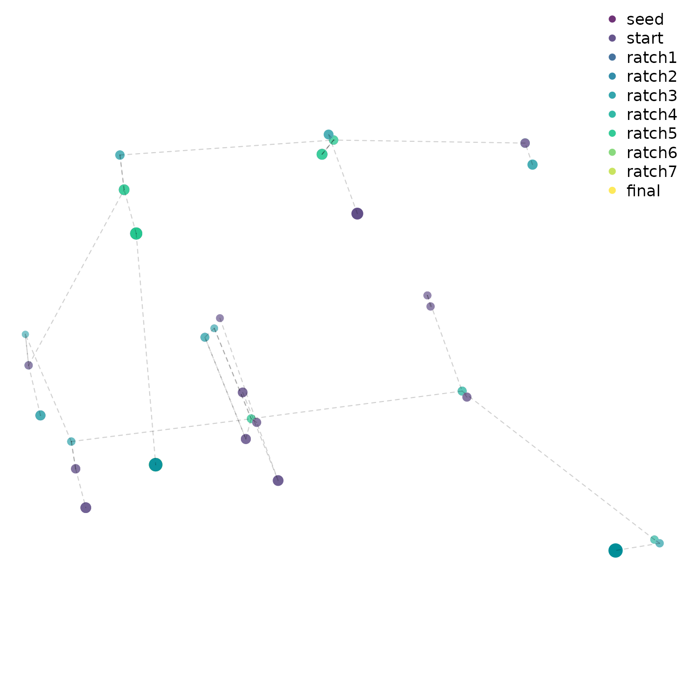
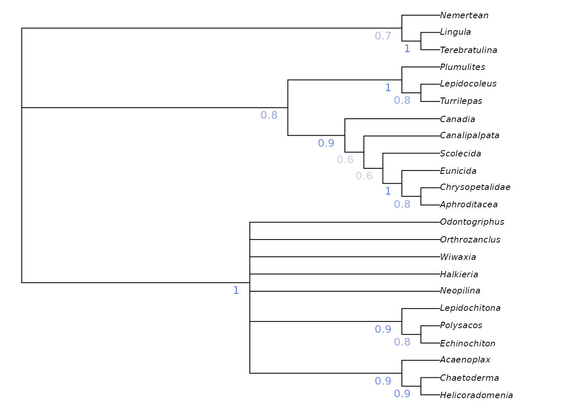
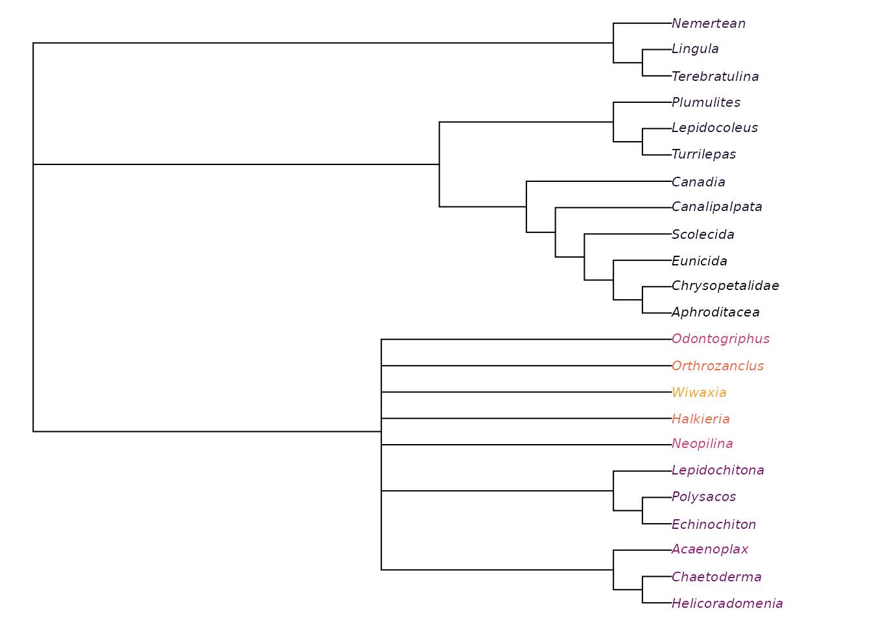

# Getting started: Simple tree searches

“TreeSearch” is an R package that allows, among other things, parsimony
search on morphological datasets that contain inapplicable data, using
the algorithm proposed by Brazeau, Guillerme and Smith (2019) and
implemented in the ‘MorphyLib’ C library (Brazeau, Smith, & Guillerme,
2017)
([details](https://rawgit.com/TGuillerme/Inapp/c4d502fa4ae3702eb207b2da3a692e469ba3b6ab/inst/gitbook/_book/index.html)).

## Getting started

[A companion
vignette](https://ms609.github.io/TreeSearch/articles/getting-started.md)
gives details on installing the package and getting up and running.

Launch an interactive ‘app’ in your browser by typing
[`TreeSearch::EasyTrees()`](https://ms609.github.io/TreeSearch/reference/MaximizeParsimony.md)
at the R / RStudio command line.

This will allow you to load data from a file, modify search settings,
and explore the distribution of most parsimonious trees in tree space.


Starting parsimony search

View a consensus tree and explore the position of rogue taxa (Smith,
2022b):


Visualizing position of rogue taxon on search result consensus tree

Explore the distribution of trees (whether found by search or loaded
from file) in tree space (Smith, 2022a), and evaluate search progress
(Whidden & Matsen, 2015):


Evaluating search progress using tree space

Map characters on a chosen tree, using character and taxon notes
imported from a Nexus file, if present. (This is designed to be
interoperable with [MorphoBank](https://morphobank.org) matrices.)


Mapping character reconstructions

Trees can be saved as images, or in Nexus/Newick for further analysis.

## Command line tree search

You can also run tree searches using the R command line. Once installed,
load the “TreeSearch” package into R using

``` r
library("TreeSearch")
```

You can [load your own
dataset](https://ms609.github.io/TreeTools/articles/load-data.html), but
for now, we’ll use the Vinther *et al.* (2008) dataset that comes
bundled with “TreeSearch”.

This dataset is small enough that it runs reasonably quickly, but its
phylogenetic signal is obscure enough that it can require Ratchet
searches to escape from local optima.

``` r
vinther <- TreeSearch::inapplicable.phyData[["Vinther2008"]]
```

``` r
# Set a random seed so that random functions in this document are reproducible
RNGversion("3.5.0")
```

    ## Warning in RNGkind("Mersenne-Twister", "Inversion", "Rounding"): non-uniform
    ## 'Rounding' sampler used

``` r
set.seed(0)
```

We can conduct a basic parsimony search with:

``` r
bestTrees <- MaximizeParsimony(vinther)
```

It can be instructive to inspect the progress of tree search.

``` r
firstHit <- attr(bestTrees, "firstHit")
firstHit
```

    ##   seed  start ratch1 ratch2 ratch3 ratch4 ratch5 ratch6 ratch7  final 
    ##      0     27      0      0     15      2      6      0      1      0

Here, we can see that many of the earliest ratchet iterations were
finding optimal trees that had not previously been visited. Later
iterations found progressively fewer new trees, suggesting that the
search is likely to have been effective.

Advanced users might wish to visualize the progress of tree search by
mapping tree space:

``` r
distances <- TreeDist::ClusteringInfoDistance(bestTrees)
searchStages <- length(firstHit)
map <- cmdscale(distances, k = 3)
cols <- hcl.colors(searchStages, alpha = 0.8)
par(mar = rep(0, 4))
TreeDist::Plot3(map,
                col = cols[rep(seq_along(firstHit), firstHit)],
                pch = 16, cex = 2,
                axes = FALSE, xlab = "", ylab = "", asp = 1)
TreeTools::MSTEdges(distances, plot = TRUE, map[, 1], map[, 2],
                    col = "#00000030", lty = 2)
legend("topright", names(firstHit), col = cols, pch = 16, bty = "n")
```



A quick glance suggests that early ratchet iterations captured a large
part of the diversity of optimal trees, and that iterations aren’t
getting stuck in local optima – though conscientious users will [ensure
that the mapping of tree space is meaningful and
adequate](https://ms609.github.io/TreeDist/articles/treespace.html) to
detect structure before making any firm conclusions (Smith, 2022a).

To be thorough, we might consider continuing the search for a little
longer, fine-tuning the search parameters:

``` r
bestTrees <- MaximizeParsimony(vinther, tree = bestTrees,
                               ratchIter = 6L,
                               tbrIter = 4L, 
                               finalIter = 3L,
                               maxHits = 80L)
```

As it happens, the best tree for this dataset has a score of 79 under
equal weights parsimony.

We can plot the best tree(s) that we’ve found, and check its parsimony
score (length):

``` r
par(mar = rep(0.25, 4), cex = 0.75) # make plot easier to read
plot(ape::consensus(bestTrees))
```


``` r
TreeLength(bestTrees[[1]], vinther)
```

    ## [1] 79

### Evaluating clade support

We might be interested in labelling clades with their frequency among
the sampled most-parsimonious trees:

``` r
par(mar = rep(0.25, 4), cex = 0.75) # make plot easier to read
majCons <- ape::consensus(bestTrees, p = 0.5)
splitFreqs <- TreeTools::SplitFrequency(majCons, bestTrees) / length(bestTrees)
plot(majCons)
TreeTools::LabelSplits(majCons, round(splitFreqs * 100), unit = "%",
                       col = TreeTools::SupportColor(splitFreqs),
                       frame = "none", pos = 3L)
```


This approach is a sensible way to analyse clade credibility when the
frequency of a split corresponds to its probability, as is the case in a
Bayesian posterior sample of trees. This is not the case, however, in
sets of most parsimonious trees.

Imagine if our set of most parsimonious trees was expanded to include a
single additional tree in which *Halkieria* was sister to the brachiopod
*Terebratulina* (close to the outgroup). We would then be in a situation
in which *Halkieria* may be a brachiopod – in which case a single
interpretation of molluscan relationships is most parsimonious – or may
be a mollusc, in which case its mosaic of characters can be reconciled
with molluscs in a number of equally-parsimonious ways. Neither
interpretation should be considered more or less plausible, even if we
observe more unique most parsimonious trees in which *Halkieria* is a
mollusc simply because of the greater resultant uncertainty in the
placement of taxa such as *Odontogriphus* and *Wiwaxia*.

A more instructive measure of clade support can be generated using
Jackknife resampling. The
[`Resample()`](https://ms609.github.io/TreeSearch/reference/MaximizeParsimony.md)
[manual
page](https://ms609.github.io/TreeSearch/reference/MaximizeParsimony.html)
has suggestions for appropriate numbers of replicates and search
intensity, and instructions for calculating bootstrap support; the code
here gives a quick-to-run jackknife framework that can be adapted to the
requirements of a particular dataset.

``` r
nReplicates <- 10
jackTrees <- lapply(logical(nReplicates), function (x)
  Resample(vinther, bestTrees, ratchIter = 0, tbrIter = 1, maxHits = 4,
           verbosity = 0)
)

strict <- ape::consensus(bestTrees, p = 1)

par(mar = rep(0, 4), cex = 0.8)
# Take the strict consensus of all trees for each replicate
JackLabels(strict, lapply(jackTrees, ape::consensus)) -> XX
```



Jackknife and bootstrap support values give an indication of the volume
of data that supports each node, but don’t necessarily indicate whether
the data are unanimous on the existence of a clade: a high bootstrap
support value could indicate a large number of characters supporting a
clade, and an only slightly smaller number of characters contradicting
it.

“TreeSearch” implements a number of concordance measures that aim to
indicate whether a dataset is unanimous or divided in support of a
grouping, independently of the method of tree reconstruction.

``` r
concordance <- QuartetConcordance(strict, vinther)

# Alternative measures:
# concordance <- ClusteringConcordance(strict, vinther)
# concordance <- PhylogeneticConcordance(strict, vinther)

par(mar = rep(0, 4), cex = 0.8)
plot(strict)
TreeTools::LabelSplits(strict, signif(concordance, 3),
                       col = TreeTools::SupportColor(concordance / max(concordance)),
                       frame = "none", pos = 3L)
```


### Exploring taxon stability

Measure of clade support can only captures one aspect of the uncertainty
in a set of trees. Often one “rogue” taxon with an uncertain position
can mask agreement in the relationships of other taxa (Smith, 2022b).
The potential impact of rogue taxa can be explored by colouring
individual tips according to their stability in the tree set:

``` r
par(mar = rep(0, 4), cex = 0.8)

plot(strict, tip.color = Rogue::ColByStability(bestTrees))
```



Would removing an unstable taxon reveal hidden support for relationships
at the base of Mollusca? We can test to see whether the removal of a
taxon from a summary tree is justified using:

``` r
Rogue::QuickRogue(bestTrees, p = 1)
```

    ##   num taxNum   taxon rawImprovement       IC
    ## 1   0   <NA>    <NA>             NA 154.5491
    ## 2   1     21 Wiwaxia       14.32221 168.8713

In this case, dropping *Wiwaxia* would improve the resolution of the
strict consensus by enough to justify the loss of the information
regarding its own position (a net gain of 14.3 bits). The most
informative single summary tree is thus provided by:

``` r
par(mar = rep(0, 4), cex = 0.8)
noWiwaxia <- lapply(bestTrees, TreeTools::DropTip, "Wiwaxia")
plot(ape::consensus(noWiwaxia), tip.color = Rogue::ColByStability(noWiwaxia))
```


This reveals that all trees agree that *Halkieria* and *Orthrozanclus*
are closer to aculiferan molluscs than *Odontogriphus* and *Neopilina*,
a fact masked in the strict consensus due to the uncertain position of
*Wiwaxia*.

We can see where *Wiwaxia* would plot on this tree using:

``` r
par(mar = rep(0, 4), cex = 0.8)
xx <- TreeTools::RoguePlot(bestTrees, "Wiwaxia", p = 1)
```


Brighter greens indicate that more trees contained *Wiwaxia* in this
position.

More details on rogue taxon identification are available in the package
[“Rogue”](https://ms609.github.io/Rogue/).

## Implied weighting

Equal weights produces trees that are less accurate and less precise
than implied weights (Smith, 2019); equally weighted analysis should
never be conducted without also considering the results of implied
weights (Goloboff, 1993, 1997), ideally under a range of concavity
constants (cf. Smith & Ortega-Hernández, 2014).

Implied weights can be activated by simply specifying a value of the
concavity constant, *k*:

``` r
iwTrees <- MaximizeParsimony(vinther, concavity = 10)
par(mar = rep(0.25, 4), cex = 0.75) # make plot easier to read
plot(ape::consensus(iwTrees))
```


Note that we recommend a default value of 10, somewhat higher than the
default of 3 in TNT; this low default gives poorer results in many
settings (Goloboff, Torres, & Arias, 2018; Smith, 2019). Better still is
to use multiple values and compare the results, perhaps in [Tree
space](https://ms609.github.io/TreeDist/articles/treespace.html). Even
better (?) is to use [profile
parsimony](https://ms609.github.io/TreeSearch/articles/profile.html).

## Constraining a search

It is sometimes legitimate to insist that trees must contain a certain
clade. Doing so reduces the number of tree rearrangements that are
considered, and can this speed up tree search.

“TreeSearch” supports soft constraints, which can be specified using a
separate Nexus file, or by creating a `phyDat` object in R. Constraints
are effectively phylogenetic characters; only trees on which each such
character fits perfectly will be considered. The position of taxa not
listed in a constraint will not be constrained.

[`MaximizeParsimony()`](https://ms609.github.io/TreeSearch/reference/MaximizeParsimony.md)
will attempt to find a starting tree that satisfies the constraints, but
if it cannot, it may be necessary to specify one manually – perhaps
after checking that no constraints are contradictory.

Here’s a simple example on six taxa that enforces the bipartition ab \|
cdef:

``` r
library("TreeTools", quietly = TRUE)
constraint <- MatrixToPhyDat(c(a = 1, b = 1, c = 0, d = 0, e = 0, f = 0))
characters <- MatrixToPhyDat(matrix(
  c(0, 1, 1, 1, 0, 0,
    1, 1, 1, 0, 0, 0), ncol = 2,
  dimnames = list(letters[1:6], NULL)))
plot(MaximizeParsimony(characters, constraint = constraint,
                       verbosity = -1)[[1]])
```


Here’s a more complex example that imposes the splits `ab | cef` and
`abcd | ef`, whilst allowing `g` to plot anywhere on the tree:

``` r
characters <- MatrixToPhyDat(matrix(
  c(0, 0, 1, 1, 1, 1, 1,
    1, 1, 1, 1, 0, 0, 0), ncol = 2,
  dimnames = list(letters[1:7], NULL)))
constraint <- MatrixToPhyDat(matrix(
  c(0, 0, 1, "?", 1, 1,
    1, 1, 1,   1, 0, 0), ncol = 2,
  dimnames = list(letters[1:6], NULL)))
plot(MaximizeParsimony(characters, constraint = constraint,
                       verbosity = -1)[[1]])
```


Constraints can also be loaded from a Nexus file with
`constraint <- TreeTools::ReadAsPhyDat("constraint_file.nex")`.

## Where next?

- [Documentation home](https://ms609.github.io/TreeSearch/)

- [Guide to
  installation](https://ms609.github.io/TreeSearch/articles/getting-started.md)

- Search for trees using

  - [standard
    parsimony](https://ms609.github.io/TreeSearch/articles/tree-search.md)
    (corrected for inapplicable data)
  - [profile
    parsimony](https://ms609.github.io/TreeSearch/articles/profile.md)
  - [custom optimality
    criteria](https://ms609.github.io/TreeSearch/articles/custom.md)

- Explore the distribution of optimal trees in
  [mappings](https://ms609.github.io/TreeSearch/articles/tree-space.md)

## References

Brazeau, M. D., Guillerme, T., & Smith, M. R. (2019). An algorithm for
morphological phylogenetic analysis with inapplicable data. *Systematic
Biology*, *68*, 619–631. doi:
[10.1093/sysbio/syy083](https://doi.org/10.1093/sysbio/syy083)

Brazeau, M. D., Smith, M. R., & Guillerme, T. (2017). *MorphyLib: A
library for phylogenetic analysis of categorical trait data with
inapplicability*. doi:
[10.5281/zenodo.815372](https://doi.org/10.5281/zenodo.815372)

Goloboff, P. A. (1993). Estimating character weights during tree search.
*Cladistics*, *9*(1), 83–91. doi:
[10.1111/j.1096-0031.1993.tb00209.x](https://doi.org/10.1111/j.1096-0031.1993.tb00209.x)

Goloboff, P. A. (1997). Self-weighted optimization: tree searches and
character state reconstructions under implied transformation costs.
*Cladistics*, *13*(3), 225–245. doi:
[10.1111/j.1096-0031.1997.tb00317.x](https://doi.org/10.1111/j.1096-0031.1997.tb00317.x)

Goloboff, P. A., Torres, A., & Arias, J. S. (2018). Weighted parsimony
outperforms other methods of phylogenetic inference under models
appropriate for morphology. *Cladistics*, *34*(4), 407–437. doi:
[10.1111/cla.12205](https://doi.org/10.1111/cla.12205)

Smith, M. R. (2019). Bayesian and parsimony approaches reconstruct
informative trees from simulated morphological datasets. *Biology
Letters*, *15*(2), 20180632. doi:
[10.1098/rsbl.2018.0632](https://doi.org/10.1098/rsbl.2018.0632)

Smith, M. R. (2022a). Robust analysis of phylogenetic tree space.
*Systematic Biology*, *71*(5), 1255–1270. doi:
[10.1093/sysbio/syab100](https://doi.org/10.1093/sysbio/syab100)

Smith, M. R. (2022b). Using information theory to detect rogue taxa and
improve consensus trees. *Systematic Biology*, *71*(5), 1088–1094. doi:
[10.1093/sysbio/syab099](https://doi.org/10.1093/sysbio/syab099)

Smith, M. R., & Ortega-Hernández, J. (2014). *Hallucigenia*’s
onychophoran-like claws and the case for Tactopoda. *Nature*,
*514*(7522), 363–366. doi:
[10.1038/nature13576](https://doi.org/10.1038/nature13576)

Vinther, J., Van Roy, P., & Briggs, D. E. G. (2008). Machaeridians are
Palaeozoic armoured annelids. *Nature*, *451*(7175), 185–188. doi:
[10.1038/nature06474](https://doi.org/10.1038/nature06474)

Whidden, C., & Matsen, F. A. (2015). Quantifying MCMC exploration of
phylogenetic tree space. *Systematic Biology*, *64*(3), 472–491. doi:
[10.1093/sysbio/syv006](https://doi.org/10.1093/sysbio/syv006)
