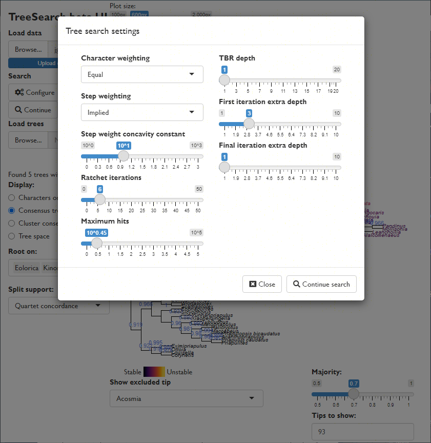

`TreeSearch` is an R package that allows, among other things, parsimony search on
morphological datasets that contain inapplicable data, following the algorithm proposed
by Brazeau, Guillerme and Smith [-@Brazeau2019].

In brief, this algorithm modifies the Fitch algorithm to count the total number
of homoplasious events on a tree.

## Getting started

[A companion vignette](getting-started.html) gives details on installing the package
and getting up and running.


## Tree search with the graphical user interface

You can launch an interactive 'app' in your browser by typing 
`TreeSearch::EasyTrees()` at the R command line.




This will allow you to load data from a file, modify search settings, and
explore the distribution of most parsimonious trees in tree space.

Trees can be saved as images, or in Nexus/Newick for further analysis.


## Command line tree search

You can also run tree searches using the R command line.
Once installed, load the 'TreeSearch' package into R using
```{r Load-library}
library('TreeSearch')
```

You can 
[load your own dataset](https://ms609.github.io/TreeTools/articles/load-data.html),
but for now, we'll use the Vinther _et al._ [-@Vinther2008] dataset that comes 
bundled with the 'TreeSearch'.

This dataset is small enough that it runs reasonably quickly, but its 
phylogenetic signal is obscure enough that it can require Ratchet searches to
escape from local optima.

```{r Load-data}
rawData <- TreeSearch::inapplicable.datasets[['Vinther2008']]
vinther <- phangorn::phyDat(rawData, type = 'USER', levels = c(0:9, '-'))
```

```{R RNG-version}
# Set a random seed so that random functions in this document are reproducible
suppressWarnings(RNGversion("3.5.0")) # Until we can require R3.6.0
set.seed(0)
```

We can conduct a basic parsimony search with:
```{r first-pass}
bestTree <- MaximizeParsimony(vinther)
```

Noting that a number of iterations failed to hit the best score, we might consider
continuing the search for a little longer, fine-tuning the search parameters:

```{r second-pass}
bestTree <- MaximizeParsimony(vinther, tree = bestTree,
                              ratchIter = 8L,
                              tbrIter = 4L, 
                              finalIter = 1L,
                              maxHits = 40L)
```

As it happens, the best tree for this dataset has a score of 79 under
equal weights parsimony.

We can plot the best tree(s) that we've found, and check its parsimony score
(length):

```{r plot-tree}
par(mar = rep(0.25, 4), cex = 0.75) # make plot easier to read
plot(ape::consensus(bestTree))
TreeLength(bestTree[[1]], vinther)
```

We might be interested in labelling clades with their frequency among the 
sampled most-parsimonious trees:

```{r plot-label-nodes}
par(mar = rep(0.25, 4), cex = 0.75) # make plot easier to read
cons <- ape::consensus(bestTree, p = 0.5)
splitFreqs <- TreeTools::SplitFrequency(cons, bestTree) / length(bestTree)
plot(cons)
TreeTools::LabelSplits(cons, round(splitFreqs * 100), unit = '%',
                       col = TreeTools::SupportColor(splitFreqs),
                       frame = 'none', pos = 3L)
```

A more instructive measure of clade support can be generated using
Jackknife resampling:

```{r Jackknife-annotations, eval = FALSE}
#TODO
jack.trees <- Jackknife(bestTree[[1]], vinther, EdgeSwapper = RootedTBRSwap,
                        jackIter = 20, verbosity = 0)
par(mar = rep(0.25, 4), cex = 0.75) # make plot easier to read

JackLabels(strict.consensus, jack.trees) -> XX
```


## Implied weighting

Equal weights produces trees that are less accurate and less precise than
implied weights [@Smith2019]; equally weighted analysis should never be
conducted without also considering the results of implied weights [@Goloboff1997],
ideally under a range of concavity constants [cf. @Smith2014].

Implied weights can be activated by simply specifying a value of the concavity 
constant, _k_:

```{r iw-search}
iwTrees <- MaximizeParsimony(vinther, concavity = 10)
par(mar = rep(0.25, 4), cex = 0.75) # make plot easier to read
plot(ape::consensus(iwTrees))
```

Note that we recommend a default value of 10, somewhat higher than the default 
of 3 in TNT; this low default probably gives poorer results in many settings
[@Smith2019].  Better still is to use multiple values and compare the results,
perhaps in 
[Tree space](https://ms609.github.io/TreeDist/articles/treespace.html).

## Constraining a search

It is sometimes legitimate to insist that trees must contain a certain clade.
Doing so reduces the number of tree rearrangements that are considered, and 
can this speed up tree search.

'TreeSearch' supports soft constraints, which can be specified using a 
separate Nexus file, or by creating a `phyDat` object in R.
Constraints are effectively phylogenetic characters; only trees on which each
such character fits perfectly will be considered.

`MaximizeParsimony()` will attempt to find a starting tree that satisfies the
constraints, but if it cannot, it may be necessary to specify one manually
-- perhaps after checking that no constraints are contradictory.

Here's a simple example on six taxa that enforces the bipartition ab | cdef:

```{r simple-constraints}
library("TreeTools", quietly = TRUE)
constraint <- MatrixToPhyDat(c(a = 1, b = 1, c = 0, d = 0, e = 0, f = 0))
characters <- MatrixToPhyDat(matrix(
  c(0, 1, 1, 1, 0, 0,
    1, 1, 1, 0, 0, 0), ncol = 2,
  dimnames = list(letters[1:6], NULL)))
plot(MaximizeParsimony(characters, constraint = constraint,
                       verbosity = -1)[[1]])
```
Here's a more complex example that imposes the splits `ab | ef` and `abc | ef`,
whilst allowing `d` to plot anywhere on the tree:

```{r complex-constraints}
constraint <- characters <- MatrixToPhyDat(matrix(
  c(0, 0, '?', '?', 1, 1,
    1, 1,   1, '?', 0, 0), ncol = 2,
  dimnames = list(letters[1:6], NULL)))
plot(MaximizeParsimony(characters, constraint = constraint,
                       verbosity = -1)[[1]])
```

Constraints can also be loaded from a Nexus file with
`constraint <- TreeTools::ReadAsPhyDat('constraint_file.nex')`.

## References
