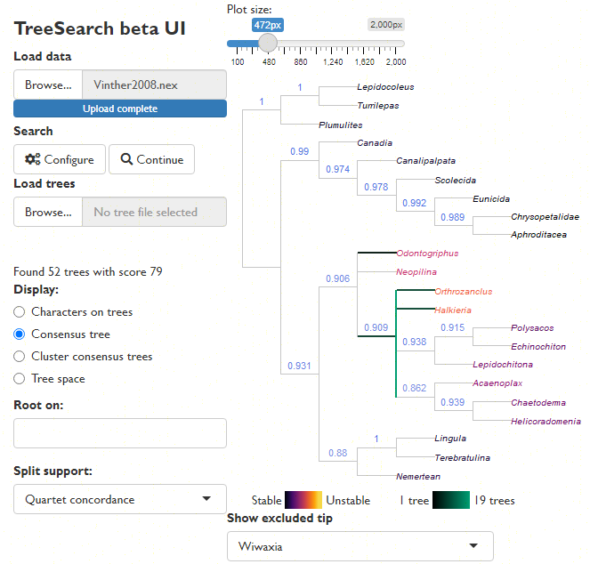
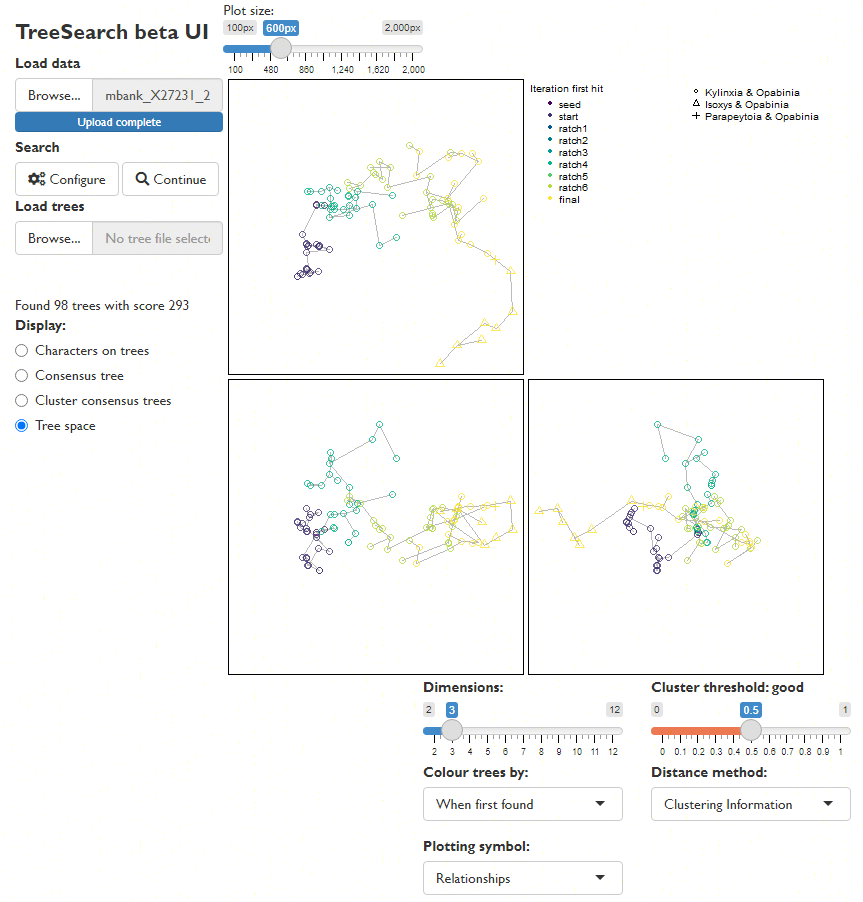

"TreeSearch" is an R package that allows, among other things, 
parsimony search on morphological datasets that contain inapplicable data,
using the algorithm proposed by Brazeau, Guillerme and Smith [-@Brazeau2019]
and implemented in the 'MorphyLib' C library [@Brazeau2017]
([details](https://cdn.jsdelivr.net/gh/TGuillerme/Inapp@c4d502fa4ae3702eb207b2da3a692e469ba3b6ab/inst/gitbook/_book/index.html)).

## Getting started

[A companion vignette](getting-started.html) gives details on installing the
package and getting up and running.

Launch an interactive 'app' in your browser by typing `TreeSearch::EasyTrees()`
at the R / RStudio command line.

This will allow you to load data from a file, modify search settings, and
explore the distribution of most parsimonious trees in tree space.


View a consensus tree and explore the position of rogue taxa:



Explore the distribution of trees (whether found by search or loaded from file)
in tree space:



Map characters on a chosen tree, using character and taxon notes imported from
a Nexus file, if present.  (This is designed to be interopable with
[MorphoBank](https://morphobank.org) matrices.)


Trees can be saved as images, or in Nexus/Newick for further analysis.


## Command line tree search

You can also run tree searches using the R command line.
Once installed, load the "TreeSearch" package into R using
```{r Load-library}
library("TreeSearch")
```

You can 
[load your own dataset](https://ms609.github.io/TreeTools/articles/load-data.html),
but for now, we'll use the Vinther _et al._ [-@Vinther2008] dataset that comes 
bundled with the "TreeSearch".

This dataset is small enough that it runs reasonably quickly, but its 
phylogenetic signal is obscure enough that it can require Ratchet searches to
escape from local optima.

```{r Load-data}
rawData <- TreeSearch::inapplicable.datasets[['Vinther2008']]
vinther <- phangorn::phyDat(rawData, type = 'USER', levels = c(0:9, '-'))
```

```{R RNG-version}
# Set a random seed so that random functions in this document are reproducible
suppressWarnings(RNGversion("3.5.0")) # Until we can require R3.6.0
set.seed(0)
```

We can conduct a basic parsimony search with:
```{r first-pass, message = FALSE}
bestTrees <- MaximizeParsimony(vinther)
```

It can be instructive to inspect the progress of tree search.

```{r inspect-progress}
firstHit <- attr(bestTrees, 'firstHit')
firstHit
```

Here, we can see that many of the earliest ratchet iterations were finding
optimal trees that had not previously been visited.
Later iterations found progressively fewer new trees, suggesting that the
search is likely to have been effective.

Advanced users might wish to visualize the progress of tree search by mapping
tree space:

```{r map-search, fig.asp = 1}
distances <- TreeDist::ClusteringInfoDistance(bestTrees)
searchStages <- length(firstHit)
map <- cmdscale(distances, k = 3)
cols <- hcl.colors(searchStages, alpha = 0.8)
par(mar = rep(0, 4))
TreeDist::Plot3(map,
                col = cols[rep(seq_along(firstHit), firstHit)],
                pch = 16, cex = 2,
                axes = FALSE, xlab = '', ylab = '', asp = 1)
TreeTools::MSTEdges(distances, plot = TRUE, map[, 1], map[, 2],
                    col = '#00000030', lty = 2)
legend('topright', names(firstHit), col = cols, pch = 16, bty = 'n')
```

A quick glance suggests that early ratchet iterations captured a large part of
the diversity of optimal trees, and that iterations aren't getting stuck in 
local optima -- though conscientious users will ensure that the mapping of tree 
space is meaningful and adequate to detect structure before making
any firm conclusions [@SmithSpace].

To be thorough, we might consider continuing the search for a little longer,
fine-tuning the search parameters:

```{r second-pass, message = FALSE}
bestTrees <- MaximizeParsimony(vinther, tree = bestTrees,
                               ratchIter = 6L,
                               tbrIter = 4L, 
                               finalIter = 3L,
                               maxHits = 80L)
```

As it happens, the best tree for this dataset has a score of 79 under
equal weights parsimony.

We can plot the best tree(s) that we've found, and check its parsimony score
(length):

```{r plot-tree}
par(mar = rep(0.25, 4), cex = 0.75) # make plot easier to read
plot(ape::consensus(bestTrees))
TreeLength(bestTrees[[1]], vinther)
```

### Evaluating clade support

We might be interested in labelling clades with their frequency among the 
sampled most-parsimonious trees:

```{r plot-label-nodes}
par(mar = rep(0.25, 4), cex = 0.75) # make plot easier to read
cons <- ape::consensus(bestTrees, p = 0.5)
splitFreqs <- TreeTools::SplitFrequency(cons, bestTrees) / length(bestTrees)
plot(cons)
TreeTools::LabelSplits(cons, round(splitFreqs * 100), unit = '%',
                       col = TreeTools::SupportColor(splitFreqs),
                       frame = 'none', pos = 3L)
```

A more instructive measure of clade support can be generated using
Jackknife resampling.
The `Resample()` manual page has suggestions for appropriate numbers of 
replicates and search intensity, and instructions for calculating bootstrap
support; the code here gives a quick-to-run jackknife framework that can be
adapted to the requirements of a particular dataset.

```{r Jackknife-annotations}
nReplicates <- 10
jackTrees <- lapply(logical(nReplicates), function (x)
  Resample(vinther, bestTrees, ratchIter = 0, tbrIter = 1, maxHits = 4,
          verbosity = 0)
)

par(mar = rep(0, 4), cex = 0.8)
# Take the strict consensus of all trees for each replicate
JackLabels(cons, lapply(jackTrees, ape::consensus)) -> XX
```

Jackknife and bootstrap support values give an indication of the volume of data
that supports each node, but don't necessarily indicate whether the data
are unanimous on the existence of a clade: a high bootstrap support value could
indicate a large number of characters supporting a clade, and an only slightly
smaller number of characters contradicting it.

"TreeSearch" implements a number of concordance measures that aim to indicate
whether a dataset is unanimous or divided in support of a grouping, 
independently of the method of tree reconstruction.

```{r concordance}
concordance <- QuartetConcordance(cons, vinther)

# Alternative measures:
# concordance <- ClusteringConcordance(cons, vinther)
# concordance <- PhylogeneticConcordance(cons, vinther)

par(mar = rep(0, 4), cex = 0.8)
plot(cons)
TreeTools::LabelSplits(cons, signif(concordance, 3),
                       col = TreeTools::SupportColor(concordance / max(concordance)),
                       frame = 'none', pos = 3L)
```


## Implied weighting

Equal weights produces trees that are less accurate and less precise than
implied weights [@Smith2019]; equally weighted analysis should never be
conducted without also considering the results of implied weights 
[@Goloboff1993;@Goloboff1997],
ideally under a range of concavity constants [cf. @Smith2014].

Implied weights can be activated by simply specifying a value of the concavity 
constant, _k_:

```{r iw-search, message = FALSE}
iwTrees <- MaximizeParsimony(vinther, concavity = 10)
par(mar = rep(0.25, 4), cex = 0.75) # make plot easier to read
plot(ape::consensus(iwTrees))
```

Note that we recommend a default value of 10, somewhat higher than the default 
of 3 in TNT; this low default gives poorer results in many settings
[@Goloboff2018;@Smith2019].
Better still is to use multiple values and compare the results,
perhaps in 
[Tree space](https://ms609.github.io/TreeDist/articles/treespace.html).
Even better (?) is to use [profile parsimony](https://ms609.github.io/TreeSearch/articles/profile.html).

## Constraining a search

It is sometimes legitimate to insist that trees must contain a certain clade.
Doing so reduces the number of tree rearrangements that are considered, and 
can this speed up tree search.

"TreeSearch" supports soft constraints, which can be specified using a 
separate Nexus file, or by creating a `phyDat` object in R.
Constraints are effectively phylogenetic characters; only trees on which each
such character fits perfectly will be considered.
The position of taxa not listed in a constraint will not be constrained.

`MaximizeParsimony()` will attempt to find a starting tree that satisfies the
constraints, but if it cannot, it may be necessary to specify one manually
-- perhaps after checking that no constraints are contradictory.

Here's a simple example on six taxa that enforces the bipartition ab | cdef:

```{r simple-constraints, message = FALSE}
library("TreeTools", quietly = TRUE, warn.conflicts = FALSE)
constraint <- MatrixToPhyDat(c(a = 1, b = 1, c = 0, d = 0, e = 0, f = 0))
characters <- MatrixToPhyDat(matrix(
  c(0, 1, 1, 1, 0, 0,
    1, 1, 1, 0, 0, 0), ncol = 2,
  dimnames = list(letters[1:6], NULL)))
plot(MaximizeParsimony(characters, constraint = constraint,
                       verbosity = -1)[[1]])
```

Here's a more complex example that imposes the splits `ab | cef` and `abcd | ef`,
whilst allowing `g` to plot anywhere on the tree:

```{r complex-constraints, message = FALSE}
characters <- MatrixToPhyDat(matrix(
  c(0, 0, 1, 1, 1, 1, 1,
    1, 1, 1, 1, 0, 0, 0), ncol = 2,
  dimnames = list(letters[1:7], NULL)))
constraint <- MatrixToPhyDat(matrix(
  c(0, 0, 1, '?', 1, 1,
    1, 1, 1,   1, 0, 0), ncol = 2,
  dimnames = list(letters[1:6], NULL)))
plot(MaximizeParsimony(characters, constraint = constraint,
                       verbosity = -1)[[1]])
```

Constraints can also be loaded from a Nexus file with
`constraint <- TreeTools::ReadAsPhyDat('constraint_file.nex')`.

## References
