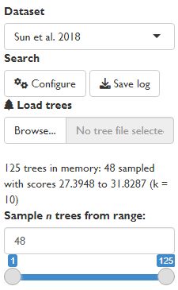
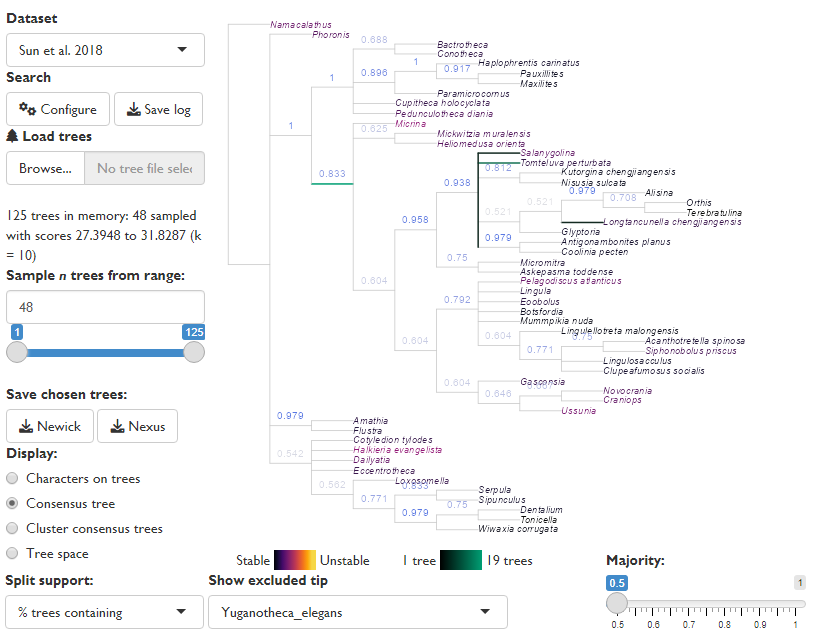
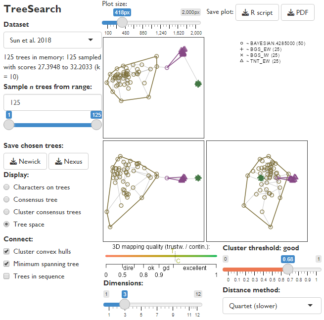
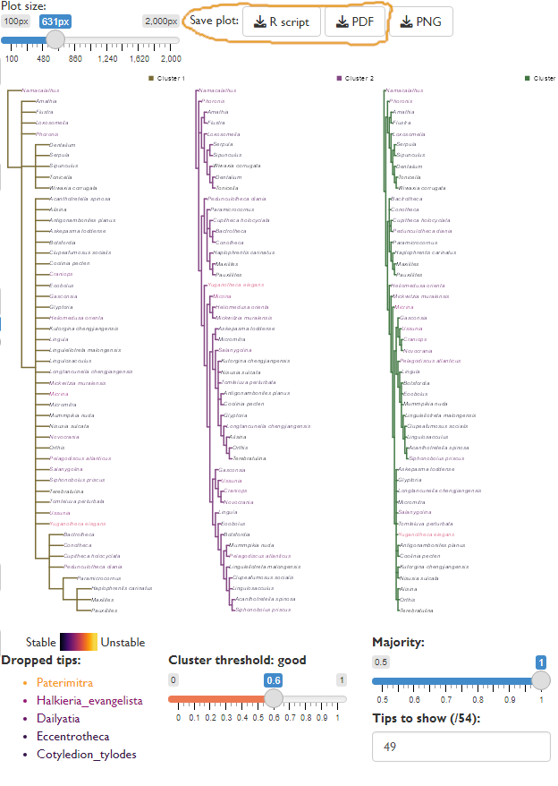

Mapping the distribution of trees in "tree space" can reveal patterns in
the set of optimal trees, and allow additional details to be obtained
from results that may appear to lack resolution [@SmithSpace].

The 'TreeSearch' GUI allows rapid visualisation of tree spaces and the
construction of cluster consensus trees, to depict the underlying structure
inherent in a set of optimal trees.

More detailed tree space analysis can also be conducted using the
['TreeDist' package](
https://ms609.github.io/TreeDist/articles/treespace.html).


# Loading trees into the GUI

This example uses the @Sun2018 dataset included with the
TreeSearch package, which contains trees generated under four optimality
criteria.
The approach will work on search results generated by tree search within the
GUI, or any set of trees loaded using the "Load trees" function.

For rapid processing, large tree sets are down-sampled when loaded: here,
48 of the 125 trees are used for analysis.
This is useful for obtaining an initial overview of results; including more
trees gives a more complete picture but results will take quadratically longer
to generate.

If loading the output of a Bayesian analysis, you may wish to modify the range
of trees sampled to exclude trees generated during the burn-in phase.




Equivalent R code can be downloaded using the "Save plot: R script" button,
and is provided here for reference:

```{r load-trees}
# Load required libraries 
library("TreeTools", quietly = TRUE) 
library("TreeDist") 
library("TreeSearch") 
  

# Load Sun et al. 2018 trees from TreeSearch package
treeFile <- system.file("datasets/Sun2018.nex", package = "TreeSearch")

# Load trees from your own file with
# treeFile <- "Path/to/my.file"
# 
# To check and set working directory, use:
# getwd() # Should match location of data / tree files 
# setwd(".") # Replace . with desired/directory to change 

# Read all trees from file
trees <- read.nexus(treeFile) 

# Down-sample to a maximum of 48 trees
trees <- trees[unique(as.integer(seq.int(1, length(trees), length.out = 48)))] 
```

# Exploring the consensus

The GUI will initially display the strict consensus of the input trees, after
gaining as much information as possible by removing any "rogue" taxa
whose position is highly variable [@SmithCons].

If trees were generated by a probabilistic sampling process (e.g. Markov Chain)
then a majority rule consensus (figure: Majority = 0.5)
may reveal additional resolution,
but note that the frequency of splits in trees found by parsimony search does
not correspond to split support -- only the strict consensus tree has any
direct interpretation in this setting.




Equivalent R code can be downloaded using the "Save plot: R script" button
within the GUI, and is provided here for reference:

```{r exploring-consensus, fig.keep = "none"}
# Select an appropriate majority value
# When analysing parsimony results, this value should be 1.
majority <- 0.5

# Identify rogue taxa
exclude <- Rogue::QuickRogue(trees, p = majority)$taxon[-1]
exclude

# Select a rogue whose positions should be depicted
plottedRogue <- exclude[1]

# Remove other excluded taxa from tree
consTrees <- lapply(trees, DropTip, setdiff(exclude, plottedRogue))

# Colour tip labels according to their original 'instability' (Smith 2022a)
tipCols <- Rogue::ColByStability(trees)

# Our plotted rogue will not appear on the tree
tipCols <- tipCols[setdiff(consTrees[[1]]$tip.label, plottedRogue)] 


# Set up plotting area 
par(
 mar = c(0, 0, 0, 0), # Zero margins 
 cex = 0.8            # Smaller font size 
)

# Plot the reduced consensus tree, showing position of our plotted rogue 
plotted <- RoguePlot( 
 trees = consTrees, 
 tip = plottedRogue,
 p = majority, 
 edgeLength = 1, 
 tip.color = tipCols 
) 

# Calculate split concordance
concordance <- SplitFrequency(plotted$cons, trees) / length(trees)

# Annotate splits by concordance 
LabelSplits(
 tree = plotted$cons,
 labels = signif(concordance, 3),
 col = SupportColor(concordance),
 frame = "none",
 pos = 3
) 
```

# The structure of tree space

The "Tree space" display option plots trees as points, and attempts to map the
distribution of points such that the distance between mapped points corresponds
to the tree distance between each pair of trees.

The default method (Clustering Information distance) has many advantages over
the widely-used Robinson--Foulds distance [@Smith2020; @SmithSpace];
the quartet distance, whilst slower to calculate, can also produce good
low-dimensional mappings of tree space.

The number of dimensions of space can be reduced to make mappings easier to
interpret, but do check that the mapping quality gauge remains at least "good",
or perceived structure may be an artefact of distortion.



In this dataset, trees are assigned to three distinct clusters, and display
"good" structure: clusters are marked only when their silhouette coefficient
is greater than the threshold, whose interpretation is marked above the slider
(here, 0.68 is "good").
As it happens, the clusters largely correspond to the tree reconstruction
method used:
@Fitch1971 parsimony (TNT_EW) trees form one distinct cluster;
trees under "BGS" inapplicable-corrected parsimony [@Brazeau2019] another;
and Bayesian trees a final, more diffuse cluster.

## Tree space analysis in R


More sophisticated tree space analysis can be conducted using the
['TreeDist' package](
https://ms609.github.io/TreeDist/articles/treespace.html).

Sample R code can be downloaded using the "Save plot: R script" button
within the GUI, and is provided here for reference:

## Generate distances

Different tree distances reflect different aspects of tree similarity, which
may or may not be relevant to phylogenetic questions [@Smith2020; @SmithSpace].

```{r tree-distances, fig.keep = "none"}
# Compute distances between pairs of trees
dists <- TreeDist::ClusteringInfoDistance(trees)
```

```{r quartet-distance, eval = FALSE}
# The quartet distance is a slower alternative:
library("Quartet")
dists <- as.dist(Quartet::QuartetDivergence( 
   Quartet::ManyToManyQuartetAgreement(trees), similarity = FALSE)
)
```

## Identify clustering structure

Here we compute clusters of trees using a selection of clustering methods
[@Hartigan1979; @Maechler2019; @Bien2011],
allowing the optimal clustering to be highlighted on the plot.

```{r compute-clusters, fig.keep = "none"}
# Try K-means clustering (Hartigan & Wong 1979):
kClusters <- lapply(
  2:15, # Minimum 2 clusters; maximum 15
  function (k) kmeans(dists, k)
)
kSils <- vapply(kClusters, function (kCluster) { 
 mean(cluster::silhouette(kCluster$cluster, dists)[, 3]) 
}, double(1)) 
bestK <- which.max(kSils) 
kSil <- kSils[bestK] # Best silhouette coefficient 
kCluster <- kClusters[[bestK]]$cluster # Best solution 

# Try partitioning around medoids (Maechler et al. 2019):
pamClusters <- lapply(2:15, function (k) cluster::pam(dists, k = k)) 
pamSils <- vapply(pamClusters, function (pamCluster) { 
 mean(cluster::silhouette(pamCluster)[, 3]) 
}, double(1)) 
bestPam <- which.max(pamSils) 
pamSil <- pamSils[bestPam] # Best silhouette coefficient 
pamCluster <- pamClusters[[bestPam]]$cluster # Best solution 

# Try hierarchical clustering with minimax linkage (Bien & Tibshirani 2011):
hTree <- protoclust::protoclust(dists) 
hClusters <- lapply(2:15, function (k) cutree(hTree, k = k)) 
hSils <- vapply(hClusters, function (hCluster) { 
 mean(cluster::silhouette(hCluster, dists)[, 3]) 
}, double(1)) 
bestH <- which.max(hSils) 
hSil <- hSils[bestH] # Best silhouette coefficient 
hCluster <- hClusters[[bestH]] # Best solution

# Set threshold for recognizing meaningful clustering 
# no support < 0.25 < weak < 0.5 < good < 0.7 < strong 
threshold <- 0.5

# Compare silhouette coefficients of each method 
bestMethodId <- which.max(c(threshold, pamSil, hSil, kSil)) 
bestCluster <- c("none", "pam", "hmm", "kmn")[bestMethodId] 

# Best clustering:
c("Structure below threshold",
  "Partitioning around medoids",
  "Hierarchical-minimax",
  "K-means")[bestMethodId]

# Best silhouette coefficient:
max(c(threshold, pamSil, hSil, kSil))

# Store the cluster to which each tree is optimally assigned: 
clustering <- switch(bestCluster, pam = pamCluster, hmm = hCluster, kmn = kCluster, 1) 
nClusters <- length(unique(clustering))
```

## Mapping tree space

Now we can map tree space into a few dimensions and visualise the distribution
of trees:

```{r map-space, fig.keep = "none"}
nDim <- 3 # Number of dimensions to plot

# Generate first dimensions of tree space using PCoA 
map <- cmdscale(dists, k = nDim) 

# Prepare plot layout 
nPanels <- nDim * (nDim - 1L) / 2L # Lower-left triangle 
plotSeq <- matrix(0, nDim, nDim)
plotSeq[upper.tri(plotSeq)] <- seq_len(nPanels)
plotSeq[nDim - 1, 2] <- max(plotSeq) + 1L
layout(t(plotSeq[-nDim, -1]))

# Set plot margins 
par(mar = rep(0.2, 4))

# Set up tree plotting symbols
treePch <- 0 # Square
clusterCol <- palette.colors(nClusters, "Alphabet", alpha = 0.8)
treeCols <- clusterCol[clustering]
for (i in 2:nDim) for (j in seq_len(i - 1)) { 
  
  # Set up blank plot 
  plot( 
    x = map[, j], 
    y = map[, i], 
    ann = FALSE,        # No annotations 
    axes = FALSE,       # No axes 
    frame.plot = TRUE,  # Border around plot 
    type = "n",         # Don't plot any points yet 
    asp = 1,            # Fix aspect ratio to avoid distortion 
    xlim = range(map),  # Constant X range for all dimensions 
    ylim = range(map)   # Constant Y range for all dimensions 
  ) 
   
  # Plot minimum spanning tree (Gower 1969) to depict distortion (Smith 2022)
  mst <- MSTEdges(as.matrix(dists)) 
  segments( 
    x0 = map[mst[, 1], j], 
    y0 = map[mst[, 1], i], 
    x1 = map[mst[, 2], j], 
    y1 = map[mst[, 2], i], 
    col = "#bbbbbb", # Light grey 
    lty = 1          # Solid lines 
  ) 
   
  # Add points
  points( 
    x = map[, j], 
    y = map[, i], 
    pch = treePch, 
    col = treeCols, 
    cex = 1.7, # Point size 
    lwd = 2 # Line width 
  ) 
   
  # Mark clusters 
  for (clI in seq_len(nClusters)) { 
    inCluster <- clustering == clI 
    clusterX <- map[inCluster, j] 
    clusterY <- map[inCluster, i] 
    hull <- chull(clusterX, clusterY) 
    polygon( 
      x = clusterX[hull], 
      y = clusterY[hull], 
      lty = 1, # Solid line style 
      lwd = 2, # Wider line width 
      border = clusterCol[clI] 
    ) 
  } 
}
```
# Using tree clustering to understand tree space structure

Plotting the consensus of trees within a specific cluster can give
more insight into the underlying relationships within a tree set than viewing 
a single strict consensus, particularly where the data do not decisively 
distinguish between a small number of well-defined but conflicting phylogenetic
hypotheses [@Stockham2002].

Visualising the consensus of each cluster can reveal this "hidden" agreement
between trees and allow more detailed and thoughtful analysis of the meaning
of the phylogenetic output.

As the limited screen space available can render large trees difficult to read,
it may be helpful to output the analysis using the "Save plot" options,
either as an R script to allow further analysis within R, or as a PDF for
more comfortable on-screen viewing.




The R code below is modified from that output by the GUI, in order to conduct
rogue taxon analysis for each cluster separately.
Note that it draws on the results of the clustering analysis above.

```{r cluster-consensus, fig.keep = "none"}
# Select proportion for majority rule consensus trees
# 1 is the appropriate value when parsimony trees are included
majority <- 1

# Plot each consensus tree in turn: 
for (i in seq_len(nClusters)) {
  clusterTrees <- trees[clustering == i]
  # Identify rogue taxa for this cluster
  clusterRogues <- Rogue::QuickRogue(clusterTrees, p = majority)$taxon[-1]
  
  # Colour tree labels based on stability across cluster
  tipCols <- Rogue::ColByStability(clusterTrees)
  
  cons <- ConsensusWithout( 
    trees = clusterTrees, 
    tip = clusterRogues,
    p = majority
  ) 
  
  # Root tree 
  cons <- RootTree(cons, trees[[1]]$tip.label[1])
  
  # Set unit edge lengths for viewing
  cons$edge.length <- rep.int(1, nrow(cons$edge)) 
  
  # Rotate nodes, to display clades in order of size 
  cons <- SortTree(cons, order = names(trees[[1]]$tip.label))
  
  # Plot tree
  par(mar = c(0, 0, 0, 0), cex = 0.8) # Set up plotting area
  plot( 
    cons, 
    edge.width = 2,             # Widen lines 
    font = 3,                   # Italicize labels 
    cex = 0.83,                 # Shrink tip font size 
    edge.color = clusterCol[i], # Colour tree according to previous plot
    tip.color = tipCols[cons$tip.label] 
  ) 
  legend(
    "bottomright", 
    paste("Cluster", i), 
    pch = 15,            # Filled circle icon 
    pt.cex = 1.5,        # Increase icon size 
    col = clusterCol[i], 
    bty = "n"            # Don't plot legend in box 
  ) 
  if (length(clusterRogues)) {
    # Mark omitted taxa, if any rogues present
    legend(
      "topright",
      clusterRogues,
      col = tipCols[clusterRogues],
      text.col = tipCols[clusterRogues],
      pch = "-",      # Mark as excluded
      cex = 0.8,      # Smaller font
      text.font = 3,  # Italicize
      bty = "n"       # Don't plot legend in box 
    )
  }
}
```

## Where next?

- [Documentation home](https://ms609.github.io/TreeSearch/)

- [Guide to installation](getting-started.html)

- Search for trees using
  - [standard parsimony](tree-search.html) (corrected for inapplicable data)
  - [profile parsimony](profile.html)
  - [custom optimality criteria](custom.Rmd)

# References
